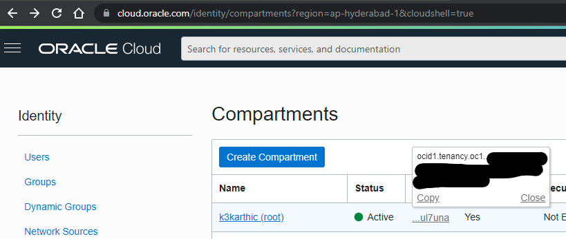
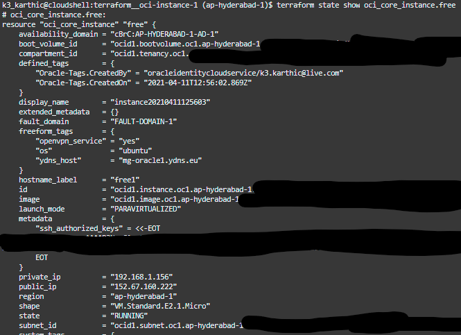
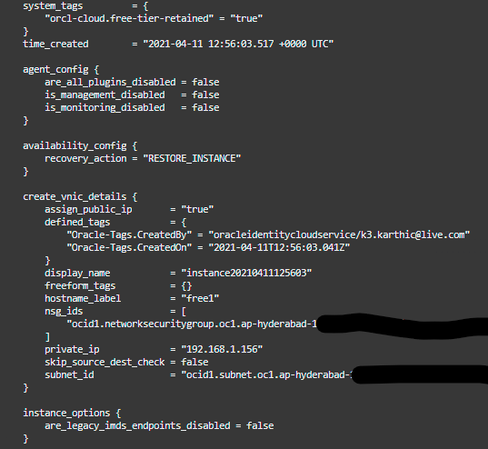
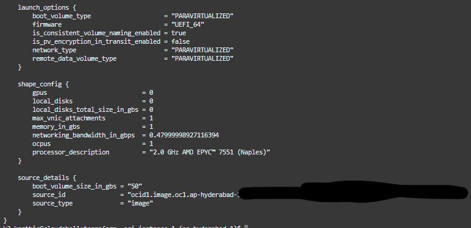

# Terraform — Deploy a single instance in Oracle Cloud

Deploy a single instance in Oracle Cloud running under the [Always Free](https://www.oracle.com/cloud/free/#always-free) tier.

A custom Virtual Cloud Network (VCN) allows for more control over network security. The Terraform script below creates a custom VCN,
* terraform__oci-vcn
    * GitHub: [github.com/k3karthic/terraform__oci-vcn](https://github.com/k3karthic/terraform__oci-vcn)
	* Codeberg: [codeberg.org/k3karthic/terraform__oci-vcn](https://codeberg.org/k3karthic/terraform__oci-vcn)

The following Ansible playbook covers basic setup for Ubuntu (e.g, swap, fail2ban),
* ansible__ubuntu-basic
	* GitHub: [github.com/k3karthic/ansible__ubuntu-basic](https://github.com/k3karthic/ansible__ubuntu-basic)
	* Codeberg: [codeberg.org/k3karthic/ansible__ubuntu-basic](https://codeberg.org/k3karthic/ansible__ubuntu-basic)

You can get a free hostname for the instance using the Ansible playbook below,
* ansible__oci-ydns
	* GitHub: [github.com/k3karthic/ansible__oci-ydns](https://github.com/k3karthic/ansible__oci-ydns)
	* Codeberg: [codeberg.org/k3karthic/ansible__oci-ydns](https://codeberg.org/k3karthic/ansible__oci-ydns)

## Code Mirrors

* GitHub: [github.com/k3karthic/terraform__oci-instance-1](https://github.com/k3karthic/terraform__oci-instance-1/)
* Codeberg: [codeberg.org/k3karthic/terraform__oci-instance-1](https://codeberg.org/k3karthic/terraform__oci-instance-1)

## Configuration

**Step 1:** Create a file to store the [Terraform input variables](https://www.terraform.io/docs/language/values/variables.html). Use `india.tfvars.sample` as a reference. Keep `india.tfvars` as the filename or change the name in the following files,

1. `.gitignore`
1. `bin/plan.sh`
    
**Step 2:** Set `ad` to the desired Availability Domain. Oracle Cloud Infrastructure randomizes the availability domains by tenancy to help balance capacity in the data centers. To get the specific names of your account, use the [ListAvailabilityDomains](https://docs.oracle.com/iaas/api/#/en/identity/latest/AvailabilityDomain/ListAvailabilityDomains) IAM API. You can also see the names when you use the Console to launch an instance and choose which availability domain to launch the instance in.

**Step 3:** Set `compartment` to the desired value. List of compartments in your Oracle Cloud account are at [cloud.oracle.com/identity/compartments](https://cloud.oracle.com/identity/compartments).



**Step 4:** Set `vcn_id` to the desired VCN ID. Set `subnet_id` to the desired Subnet ID.

## Authentication

[Oracle provider](https://registry.terraform.io/providers/hashicorp/oci/latest) documentation is at [registry.terraform.io/providers/hashicorp/oci/latest](https://registry.terraform.io/providers/hashicorp/oci/latest).

[Oracle Cloud Shell](https://www.oracle.com/devops/cloud-shell/) can deploy this script without configuration.

## Deployment

**Step 1:** Use the following command to create a [Terraform plan](https://www.terraform.io/docs/cli/run/index.html#planning),
```
$ ./bin/plan.sh
```

To avoid fetching the latest state of resources, use the following command,
```
$ ./bin/plan.sh -refresh=false
```

**Step 2:** Review the plan using the following command,
```
$ ./bin/view.sh
```

**Step 3:** [Apply](https://www.terraform.io/docs/cli/run/index.html#applying) the plan using the following command,
```
$ ./bin/apply.sh
```

**Step 4:** Use the follwing command to display the instance,
```
$ terraform show oci_core_instance.free
```





## Encryption

Encrypt sensitive files (Terraform [input variables](https://www.terraform.io/docs/language/values/variables.html), SSH public key and [state](https://www.terraform.io/docs/language/state/index.html)) before saving them. `.gitignore` must contain the unencrypted file paths.

Use the following command to decrypt the files after cloning the repository,
```
$ ./bin/decrypt.sh
```

Use the following command after running `bin/apply.sh` to encrypt the updated state files,
```
$ ./bin/encrypt.sh <gpg key id>
```
